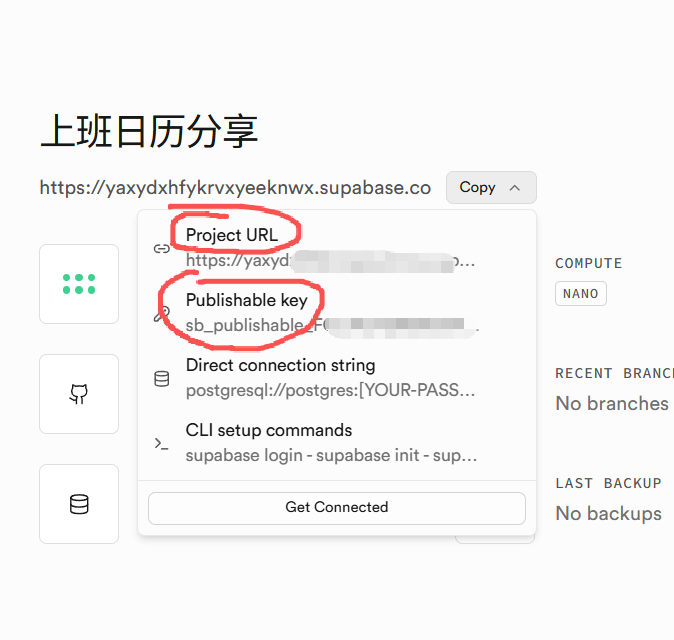
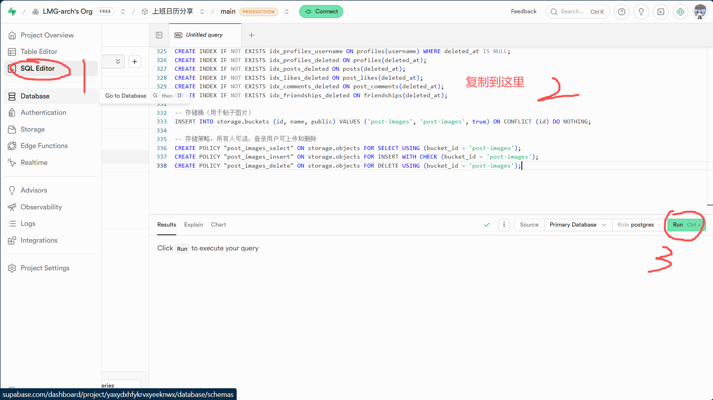
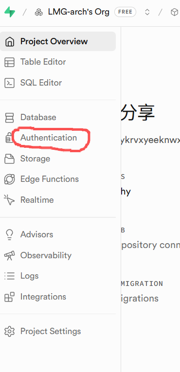
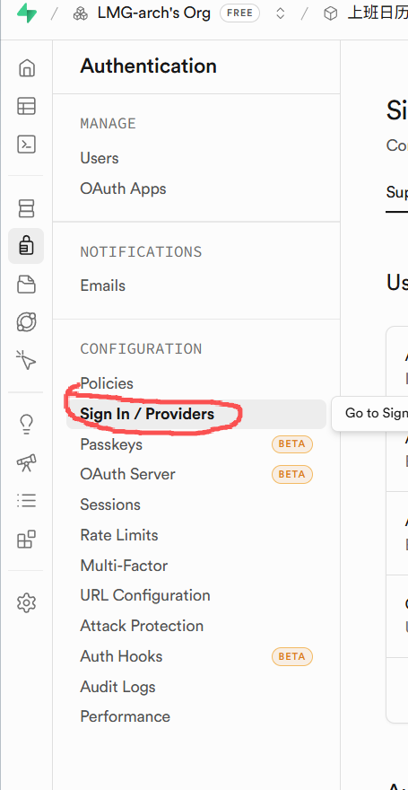
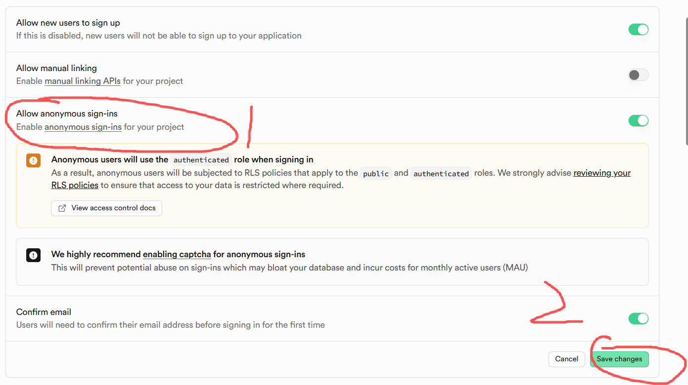

# 上班日历

一款简洁实用的上班/下班打卡提醒日历应用，支持桌面端（Electron）和安卓端（Capacitor）。

## 功能特性

### 日历视图
- 每月日历展示，支持上下月切换和触摸滑动
- 每日显示农历（初一显示月名，其他显示日名）
- 月份标题显示天干地支+生肖年+农历月名
- 每日状态标记：上班、休息、出差
- 8 种颜色标记，自定义标签（最多 8 个，含加班/迟到/远程/外勤等快捷标签）
- 备注记录，每日待办事项
- 中国法定节假日和调休日自动识别（2025-2026）
- 点击已选中的日期可收起详情面板

### 打卡提醒
- 4 个默认提醒：上班打卡 (08:30)、午休下班 (12:00)、下午上班 (13:30)、下班打卡 (17:30)
- 自定义提醒时间和标签名称
- 手动确认打卡，一键完成
- 打卡记录历史查看（最近 7 天）
- 日历单元格打卡状态指示

### 通知推送
- **桌面端**：Electron 原生通知，点击即可确认打卡
- **安卓端**：Capacitor 本地通知推送，支持后台提醒
- **通知渠道**：Android 8+ 创建高优先级通知渠道，确保提醒可见
- **权限引导**：通知权限被拒时提示用户前往系统设置开启

### 待办管理
- 指定日期待办（支持公历/农历选择）
- 每周重复待办（按星期几），支持当日完成状态切换
- 待办完成状态追踪
- **待办提醒**：为待办设置提醒时间，支持以下选项：
  - 不提醒
  - 准时提醒
  - 提前 5/10/15/30/60 分钟提醒
  - 提前 2 小时 / 提前 1 天提醒
  - 自定义提醒时间点（如 09:00）
- 待办列表显示提醒标识

### 月度统计
- 上班/休息/出差天数统计
- 可视化比例条
- 标签使用频率统计
- 节假日信息汇总

### 好友圈
- 发布文字+图片动态，好友可见（也可以自己使用，不用加好友，当自己的树洞）
- 点赞、评论互动
- 好友申请 / 同意 / 拒绝
- 个人主页，简单数字ID分享（从1开始）
- 数据通过 Supabase 免费云服务同步
- 图片通过 Supabase Storage 存储（免费1GB）
- **本地缓存**：好友动态秒开，后台静默刷新
- **管理员重置**：数字ID为1的用户可重置服务器全部数据（所有用户），其他用户不显示此功能
- **回收站**：重置的数据移入回收站，管理员可恢复或永久删除

### 数据同步
- 日历、待办、提醒等本地数据可同步到 Supabase 云端
- 可选功能，需在设置中手动开启并配置 Supabase 服务
- **多端同步**：登录同一账号，多台设备共享数据
- 开启自动同步后，每次数据变更自动上传云端
- 登录时自动从云端拉取最新数据

### 设置
- **账号注册/登录**：用户名+密码注册，数据绑定账号，换设备登录即可恢复
- 数据导出（JSON 格式）
- 数据导入
- **14 种主题风格**：可折叠收起，点击标题展开
- **导航栏自定义**：可关闭好友圈、统计等功能入口
- 开机自启开关（桌面端）
- 好友圈服务配置
- 数据同步开关与手动同步（登录同一账号自动多端同步）

## 界面导航

底部工具栏（直接点击切换页面）：

| 按钮 | 功能 |
|------|------|
| **日历** | 返回日历主页 |
| **打卡** | 打卡提醒与确认 + 待办管理 |
| **好友** | 好友圈动态 |
| **统计** | 月度数据统计 |
| **设置** | 导出导入、主题、好友圈配置 |

---

## 好友圈配置教程（详细步骤）

好友圈功能需要一个免费的 Supabase 云数据库来同步数据。以下是完整配置步骤：

### 第一步：注册 Supabase 账号

1. 打开浏览器，访问 [https://supabase.com](https://supabase.com)
2. 点击右上角 **Start your project** 按钮
3. 选择 **Sign in with GitHub**（推荐）或用邮箱注册
4. 完成登录后进入 Dashboard

### 第二步：创建项目

1. 在 Dashboard 页面，点击 **New Project** 按钮
2. 填写项目信息：
   - **Organization**: 选择或创建一个组织
   - **Project name**: 随便填，比如 `work-calendar`
   - **Database password**: 设置一个密码（记住它，但本项目不需要用）
   - **Region**: 选择 **Northeast Asia (Tokyo)** 或 **Southeast Asia (Singapore)**（离国内近）
3. 点击 **Create new project**，等待约 1 分钟创建完成

### 第三步：获取连接信息

1. 项目创建完成后，点击左侧菜单最下方的 **Project Settings**（齿轮图标）
2. 点击 **API** 选项卡
3. 找到以下两个信息并复制：
   - **Project URL**: 类似 `https://xxxxxxxx.supabase.co`
   - **anon public key**: 类似 `sb-eyJhbGxxxxxxxxxxxnR5cCI6IkpXVCJ9.xxxxx...`

   

### 第四步：创建数据库表

1. 在 Supabase Dashboard 左侧菜单，点击 **SQL Editor**
2. 点击 **New query**
3. 复制以下全部 SQL 粘贴到编辑器中：


```sql
-- 上班日历 - 好友圈数据库初始化
-- 在 Supabase Dashboard > SQL Editor 中执行

-- 用户资料表
CREATE TABLE IF NOT EXISTS profiles (
  id UUID PRIMARY KEY REFERENCES auth.users(id) ON DELETE CASCADE,
  display_id SERIAL UNIQUE,
  nickname TEXT NOT NULL DEFAULT '',
  avatar TEXT DEFAULT '',
  username TEXT UNIQUE,
  password_hash TEXT,
  linked_id UUID,
  created_at TIMESTAMPTZ DEFAULT NOW(),
  deleted_at TIMESTAMPTZ
);

-- 动态表
CREATE TABLE IF NOT EXISTS posts (
  id UUID PRIMARY KEY DEFAULT gen_random_uuid(),
  user_id UUID NOT NULL REFERENCES profiles(id) ON DELETE CASCADE,
  content TEXT NOT NULL DEFAULT '',
  image_url TEXT DEFAULT '',
  created_at TIMESTAMPTZ DEFAULT NOW(),
  deleted_at TIMESTAMPTZ
);

-- 点赞表
CREATE TABLE IF NOT EXISTS post_likes (
  id UUID PRIMARY KEY DEFAULT gen_random_uuid(),
  post_id UUID NOT NULL REFERENCES posts(id) ON DELETE CASCADE,
  user_id UUID NOT NULL REFERENCES profiles(id) ON DELETE CASCADE,
  created_at TIMESTAMPTZ DEFAULT NOW(),
  deleted_at TIMESTAMPTZ,
  UNIQUE(post_id, user_id)
);

-- 评论表
CREATE TABLE IF NOT EXISTS post_comments (
  id UUID PRIMARY KEY DEFAULT gen_random_uuid(),
  post_id UUID NOT NULL REFERENCES posts(id) ON DELETE CASCADE,
  user_id UUID NOT NULL REFERENCES profiles(id) ON DELETE CASCADE,
  content TEXT NOT NULL,
  created_at TIMESTAMPTZ DEFAULT NOW(),
  deleted_at TIMESTAMPTZ
);

-- 好友关系表
CREATE TABLE IF NOT EXISTS friendships (
  id UUID PRIMARY KEY DEFAULT gen_random_uuid(),
  user_id UUID NOT NULL REFERENCES profiles(id) ON DELETE CASCADE,
  friend_id UUID NOT NULL REFERENCES profiles(id) ON DELETE CASCADE,
  status TEXT NOT NULL DEFAULT 'pending',
  created_at TIMESTAMPTZ DEFAULT NOW(),
  deleted_at TIMESTAMPTZ,
  UNIQUE(user_id, friend_id)
);

-- 用户数据同步表（日历/待办/提醒等本地数据云端备份）
CREATE TABLE IF NOT EXISTS user_data (
  user_id UUID PRIMARY KEY REFERENCES auth.users(id) ON DELETE CASCADE,
  data JSONB NOT NULL DEFAULT '{}',
  updated_at TIMESTAMPTZ DEFAULT NOW()
);

-- 启用 RLS
ALTER TABLE profiles ENABLE ROW LEVEL SECURITY;
ALTER TABLE posts ENABLE ROW LEVEL SECURITY;
ALTER TABLE post_likes ENABLE ROW LEVEL SECURITY;
ALTER TABLE post_comments ENABLE ROW LEVEL SECURITY;
ALTER TABLE friendships ENABLE ROW LEVEL SECURITY;
ALTER TABLE user_data ENABLE ROW LEVEL SECURITY;

-- 获取有效用户ID（如果当前用户有 linked_id 则返回 linked_id，否则返回自身）
CREATE OR REPLACE FUNCTION get_effective_user_id()
RETURNS UUID
LANGUAGE plpgsql
SECURITY DEFINER
STABLE
AS $$
DECLARE
  uid UUID;
  linked UUID;
BEGIN
  uid := auth.uid();
  SELECT linked_id INTO linked FROM profiles WHERE id = uid;
  RETURN COALESCE(linked, uid);
END;
$$;

-- Profiles: 所有人可读，本人可写（通过 linked_id 关联）
CREATE POLICY "profiles_select" ON profiles FOR SELECT USING (true);
CREATE POLICY "profiles_insert" ON profiles FOR INSERT WITH CHECK (auth.uid() = id);
CREATE POLICY "profiles_update" ON profiles FOR UPDATE USING (auth.uid() = id OR get_effective_user_id() = id);

-- Posts: 所有人可读，有效用户可写删
CREATE POLICY "posts_select" ON posts FOR SELECT USING (true);
CREATE POLICY "posts_insert" ON posts FOR INSERT WITH CHECK (get_effective_user_id() = user_id);
CREATE POLICY "posts_delete" ON posts FOR DELETE USING (get_effective_user_id() = user_id);

-- Likes: 所有人可读，有效用户可写删
CREATE POLICY "likes_select" ON post_likes FOR SELECT USING (true);
CREATE POLICY "likes_insert" ON post_likes FOR INSERT WITH CHECK (get_effective_user_id() = user_id);
CREATE POLICY "likes_delete" ON post_likes FOR DELETE USING (get_effective_user_id() = user_id);

-- Comments: 所有人可读，有效用户可写删
CREATE POLICY "comments_select" ON post_comments FOR SELECT USING (true);
CREATE POLICY "comments_insert" ON post_comments FOR INSERT WITH CHECK (get_effective_user_id() = user_id);
CREATE POLICY "comments_delete" ON post_comments FOR DELETE USING (get_effective_user_id() = user_id);

-- Friendships: 有效用户相关可读写
CREATE POLICY "friendships_select" ON friendships FOR SELECT
  USING (get_effective_user_id() = user_id OR get_effective_user_id() = friend_id);
CREATE POLICY "friendships_insert" ON friendships FOR INSERT WITH CHECK (get_effective_user_id() = user_id);
CREATE POLICY "friendships_update" ON friendships FOR UPDATE
  USING (get_effective_user_id() = friend_id);
CREATE POLICY "friendships_delete" ON friendships FOR DELETE
  USING (get_effective_user_id() = user_id OR get_effective_user_id() = friend_id);

-- User Data: 有效用户可读写
CREATE POLICY "user_data_select" ON user_data FOR SELECT USING (get_effective_user_id() = user_id);
CREATE POLICY "user_data_insert" ON user_data FOR INSERT WITH CHECK (get_effective_user_id() = user_id);
CREATE POLICY "user_data_update" ON user_data FOR UPDATE USING (get_effective_user_id() = user_id);

-- 管理员重置函数（软删除，保留数据可恢复）
CREATE OR REPLACE FUNCTION reset_all_data()
RETURNS void
LANGUAGE plpgsql
SECURITY DEFINER
AS $$
BEGIN
  IF NOT EXISTS (
    SELECT 1 FROM profiles WHERE id = get_effective_user_id() AND display_id = 1
  ) THEN
    RAISE EXCEPTION '仅管理员可操作';
  END IF;

  UPDATE post_comments SET deleted_at = NOW() WHERE deleted_at IS NULL;
  UPDATE post_likes SET deleted_at = NOW() WHERE deleted_at IS NULL;
  UPDATE posts SET deleted_at = NOW() WHERE deleted_at IS NULL;
  UPDATE friendships SET deleted_at = NOW() WHERE deleted_at IS NULL;
  UPDATE profiles SET deleted_at = NOW() WHERE deleted_at IS NULL AND display_id != 1;
END;
$$;

-- 管理员恢复函数（从回收站恢复）
CREATE OR REPLACE FUNCTION restore_all_data()
RETURNS void
LANGUAGE plpgsql
SECURITY DEFINER
AS $$
BEGIN
  IF NOT EXISTS (
    SELECT 1 FROM profiles WHERE id = get_effective_user_id() AND display_id = 1
  ) THEN
    RAISE EXCEPTION '仅管理员可操作';
  END IF;

  UPDATE post_comments SET deleted_at = NULL WHERE deleted_at IS NOT NULL;
  UPDATE post_likes SET deleted_at = NULL WHERE deleted_at IS NOT NULL;
  UPDATE posts SET deleted_at = NULL WHERE deleted_at IS NOT NULL;
  UPDATE friendships SET deleted_at = NULL WHERE deleted_at IS NOT NULL;
  UPDATE profiles SET deleted_at = NULL WHERE deleted_at IS NOT NULL;
END;
$$;

-- 管理员清空回收站（永久删除）
CREATE OR REPLACE FUNCTION empty_trash()
RETURNS void
LANGUAGE plpgsql
SECURITY DEFINER
AS $$
BEGIN
  IF NOT EXISTS (
    SELECT 1 FROM profiles WHERE id = get_effective_user_id() AND display_id = 1
  ) THEN
    RAISE EXCEPTION '仅管理员可操作';
  END IF;

  DELETE FROM post_comments WHERE deleted_at IS NOT NULL;
  DELETE FROM post_likes WHERE deleted_at IS NOT NULL;
  DELETE FROM posts WHERE deleted_at IS NOT NULL;
  DELETE FROM friendships WHERE deleted_at IS NOT NULL;
  DELETE FROM profiles WHERE deleted_at IS NOT NULL;
END;
$$;

-- 查询回收站统计
CREATE OR REPLACE FUNCTION get_trash_stats()
RETURNS TABLE(table_name text, count bigint)
LANGUAGE plpgsql
SECURITY DEFINER
AS $$
BEGIN
  IF NOT EXISTS (
    SELECT 1 FROM profiles WHERE id = get_effective_user_id() AND display_id = 1
  ) THEN
    RAISE EXCEPTION '仅管理员可操作';
  END IF;

  RETURN QUERY SELECT 'profiles'::text, (SELECT COUNT(*) FROM profiles WHERE deleted_at IS NOT NULL);
  RETURN QUERY SELECT 'posts'::text, (SELECT COUNT(*) FROM posts WHERE deleted_at IS NOT NULL);
  RETURN QUERY SELECT 'comments'::text, (SELECT COUNT(*) FROM post_comments WHERE deleted_at IS NOT NULL);
  RETURN QUERY SELECT 'likes'::text, (SELECT COUNT(*) FROM post_likes WHERE deleted_at IS NOT NULL);
  RETURN QUERY SELECT 'friendships'::text, (SELECT COUNT(*) FROM friendships WHERE deleted_at IS NOT NULL);
END;
$$;

CREATE OR REPLACE FUNCTION get_trash_sizes()
RETURNS TABLE(table_name text, deleted_count bigint, total_size text)
LANGUAGE plpgsql SECURITY DEFINER AS $$
BEGIN
  IF NOT EXISTS (SELECT 1 FROM profiles WHERE id = get_effective_user_id() AND display_id = 1) THEN
    RAISE EXCEPTION '仅管理员可操作';
  END IF;
  RETURN QUERY SELECT 'profiles'::text, (SELECT COUNT(*) FROM profiles WHERE deleted_at IS NOT NULL), pg_size_pretty((SELECT pg_total_relation_size('profiles')));
  RETURN QUERY SELECT 'posts'::text, (SELECT COUNT(*) FROM posts WHERE deleted_at IS NOT NULL), pg_size_pretty((SELECT pg_total_relation_size('posts')));
  RETURN QUERY SELECT 'comments'::text, (SELECT COUNT(*) FROM post_comments WHERE deleted_at IS NOT NULL), pg_size_pretty((SELECT pg_total_relation_size('post_comments')));
  RETURN QUERY SELECT 'likes'::text, (SELECT COUNT(*) FROM post_likes WHERE deleted_at IS NOT NULL), pg_size_pretty((SELECT pg_total_relation_size('post_likes')));
  RETURN QUERY SELECT 'friendships'::text, (SELECT COUNT(*) FROM friendships WHERE deleted_at IS NOT NULL), pg_size_pretty((SELECT pg_total_relation_size('friendships')));
END;
$$;

CREATE OR REPLACE FUNCTION reset_selected(p_tables TEXT[])
RETURNS void LANGUAGE plpgsql SECURITY DEFINER AS $$
BEGIN
  IF NOT EXISTS (SELECT 1 FROM profiles WHERE id = get_effective_user_id() AND display_id = 1) THEN RAISE EXCEPTION '仅管理员可操作'; END IF;
  IF 'comments' = ANY(p_tables) THEN UPDATE post_comments SET deleted_at = NOW() WHERE deleted_at IS NULL; END IF;
  IF 'likes' = ANY(p_tables) THEN UPDATE post_likes SET deleted_at = NOW() WHERE deleted_at IS NULL; END IF;
  IF 'posts' = ANY(p_tables) THEN UPDATE posts SET deleted_at = NOW() WHERE deleted_at IS NULL; END IF;
  IF 'friendships' = ANY(p_tables) THEN UPDATE friendships SET deleted_at = NOW() WHERE deleted_at IS NULL; END IF;
  IF 'profiles' = ANY(p_tables) THEN UPDATE profiles SET deleted_at = NOW() WHERE deleted_at IS NULL AND display_id != 1; END IF;
END;
$$;

CREATE OR REPLACE FUNCTION restore_selected(p_tables TEXT[])
RETURNS void LANGUAGE plpgsql SECURITY DEFINER AS $$
BEGIN
  IF NOT EXISTS (SELECT 1 FROM profiles WHERE id = get_effective_user_id() AND display_id = 1) THEN RAISE EXCEPTION '仅管理员可操作'; END IF;
  IF 'comments' = ANY(p_tables) THEN UPDATE post_comments SET deleted_at = NULL WHERE deleted_at IS NOT NULL; END IF;
  IF 'likes' = ANY(p_tables) THEN UPDATE post_likes SET deleted_at = NULL WHERE deleted_at IS NOT NULL; END IF;
  IF 'posts' = ANY(p_tables) THEN UPDATE posts SET deleted_at = NULL WHERE deleted_at IS NOT NULL; END IF;
  IF 'friendships' = ANY(p_tables) THEN UPDATE friendships SET deleted_at = NULL WHERE deleted_at IS NOT NULL; END IF;
  IF 'profiles' = ANY(p_tables) THEN UPDATE profiles SET deleted_at = NULL WHERE deleted_at IS NOT NULL; END IF;
END;
$$;

CREATE OR REPLACE FUNCTION empty_selected(p_tables TEXT[])
RETURNS void LANGUAGE plpgsql SECURITY DEFINER AS $$
BEGIN
  IF NOT EXISTS (SELECT 1 FROM profiles WHERE id = get_effective_user_id() AND display_id = 1) THEN RAISE EXCEPTION '仅管理员可操作'; END IF;
  IF 'comments' = ANY(p_tables) THEN DELETE FROM post_comments WHERE deleted_at IS NOT NULL; END IF;
  IF 'likes' = ANY(p_tables) THEN DELETE FROM post_likes WHERE deleted_at IS NOT NULL; END IF;
  IF 'posts' = ANY(p_tables) THEN DELETE FROM posts WHERE deleted_at IS NOT NULL; END IF;
  IF 'friendships' = ANY(p_tables) THEN DELETE FROM friendships WHERE deleted_at IS NOT NULL; END IF;
  IF 'profiles' = ANY(p_tables) THEN DELETE FROM profiles WHERE deleted_at IS NOT NULL; END IF;
END;
$$;

-- 注册账号（用户名+密码哈希，绑定到当前匿名用户）
CREATE OR REPLACE FUNCTION register_username(p_username TEXT, p_password_hash TEXT)
RETURNS json
LANGUAGE plpgsql
SECURITY DEFINER
AS $$
DECLARE
  existing_id UUID;
BEGIN
  SELECT id INTO existing_id FROM profiles WHERE username = p_username AND deleted_at IS NULL;
  IF existing_id IS NOT NULL THEN
    RETURN json_build_object('error', '用户名已存在');
  END IF;

  UPDATE profiles SET username = p_username, password_hash = p_password_hash
  WHERE id = auth.uid();

  IF NOT FOUND THEN
    INSERT INTO profiles (id, nickname, username, password_hash)
    VALUES (auth.uid(), p_username, p_username, p_password_hash);
  END IF;

  RETURN json_build_object('user_id', auth.uid());
END;
$$;

-- 登录账号（验证密码，通过 linked_id 关联，不迁移数据）
CREATE OR REPLACE FUNCTION login_username(p_username TEXT, p_password_hash TEXT)
RETURNS json
LANGUAGE plpgsql
SECURITY DEFINER
AS $$
DECLARE
  target_user UUID;
  curr UUID;
BEGIN
  curr := auth.uid();

  SELECT id INTO target_user FROM profiles
  WHERE username = p_username AND password_hash = p_password_hash AND deleted_at IS NULL;

  IF target_user IS NULL THEN
    RETURN json_build_object('error', '用户名或密码错误');
  END IF;

  IF target_user = curr THEN
    RETURN json_build_object('user_id', curr);
  END IF;

  -- 设置 linked_id，指向目标用户
  INSERT INTO profiles (id, nickname, linked_id)
  VALUES (curr, 'linked', target_user)
  ON CONFLICT (id) DO UPDATE SET linked_id = target_user;

  RETURN json_build_object('user_id', target_user);
END;
$$;

-- 索引
CREATE INDEX IF NOT EXISTS idx_posts_user ON posts(user_id);
CREATE INDEX IF NOT EXISTS idx_posts_time ON posts(created_at DESC);
CREATE INDEX IF NOT EXISTS idx_likes_post ON post_likes(post_id);
CREATE INDEX IF NOT EXISTS idx_comments_post ON post_comments(post_id);
CREATE INDEX IF NOT EXISTS idx_friendships_user ON friendships(user_id);
CREATE INDEX IF NOT EXISTS idx_friendships_friend ON friendships(friend_id);
CREATE INDEX IF NOT EXISTS idx_profiles_username ON profiles(username) WHERE deleted_at IS NULL;
CREATE INDEX IF NOT EXISTS idx_profiles_deleted ON profiles(deleted_at);
CREATE INDEX IF NOT EXISTS idx_posts_deleted ON posts(deleted_at);
CREATE INDEX IF NOT EXISTS idx_likes_deleted ON post_likes(deleted_at);
CREATE INDEX IF NOT EXISTS idx_comments_deleted ON post_comments(deleted_at);
CREATE INDEX IF NOT EXISTS idx_friendships_deleted ON friendships(deleted_at);

-- 存储桶（用于帖子图片）
INSERT INTO storage.buckets (id, name, public) VALUES ('post-images', 'post-images', true) ON CONFLICT (id) DO NOTHING;

-- 存储策略：所有人可读，登录用户可上传和删除
CREATE POLICY "post_images_select" ON storage.objects FOR SELECT USING (bucket_id = 'post-images');
CREATE POLICY "post_images_insert" ON storage.objects FOR INSERT WITH CHECK (bucket_id = 'post-images');
CREATE POLICY "post_images_delete" ON storage.objects FOR DELETE USING (bucket_id = 'post-images');
```

4. 点击右下角 **Run** 按钮执行
5. 看到 `Success. No rows returned` 表示成功

### 第五步：开启匿名登录

1. 在 Supabase Dashboard 左侧菜单，点击 **Authentication**
2. 点击 **Providers** 选项卡
3. 找到 **Allow anonymous sign-ins**，将开关**打开**
4. 点击 **Save** 保存

> 💡 账号系统基于匿名认证 + 数据库函数实现，用户名和密码哈希存储在 profiles 表中，无需配置邮箱服务。

### 第六步：在 App 中配置

1. 打开上班日历 App
2. 点击底部工具栏 **设置**
3. 找到 **好友圈服务配置** 区域
4. 填入第三步获取的：
   - **Project URL**: 粘贴你的 URL
   - **Anon Key**: 粘贴你的 Key
5. 点击 **保存配置**
6. 点击 **测试连接**，会显示详细诊断结果，全部通过即可

### 第七步：开始使用

1. 点击底部工具栏 **好友** 进入好友圈
2. 点击 **我的** 标签页，复制你的**数字ID**（如 `1`、`2`）发给朋友
3. 朋友在 **好友** 标签页输入你的数字ID，点击添加
4. 你收到好友申请后点击同意
5. 之后就可以互相看到动态了！

---

## 账号注册与数据同步教程

### 为什么需要注册账号？

- 不注册：使用匿名用户，UUID 可能变化，数据会丢失
- 注册后：UUID 绑定到账号，**永不变化**，换设备登录即可恢复

### 注册步骤

1. 完成上方「好友圈配置教程」的全部步骤（确保 Supabase 服务已配置好）
2. 打开 App → **设置** → **账号** 区域
3. 输入**用户名**（2-20个字符，支持中英文、数字、下划线）
4. 输入**密码**（至少4个字符）
5. 点击 **注册**
6. 显示「注册成功」即完成

> 注册时会自动创建匿名会话并绑定用户名，密码以 SHA-256 哈希存储，不明文保存。

### 登录（换设备）

1. 在新设备上配置好 Supabase 服务（同上）
2. **设置** → **账号** → 输入相同的用户名和密码
3. 点击 **登录**
4. 登录后自动同步云端数据

### 数据同步

注册账号后，可以开启自动同步功能：

1. **设置** → **数据同步**
2. 点击 **自动同步：开启**
3. 之后每次修改日历、待办、提醒等数据，都会自动上传云端
4. 换设备登录同一账号，自动从云端拉取最新数据
5. 多台设备同时在线，数据通过云端实时同步

### 导航栏自定义

可以关闭不需要的功能入口：

1. **设置** → **导航栏设置**（点击标题展开）
2. 点击开关按钮关闭/开启功能
3. 日历和设置为固定项，不可关闭

### 注意事项

- Supabase 免费额度：50,000 月活用户、500MB 数据库、1GB 存储空间，日常使用完全够用
- Anon Key 是公开密钥，安全的，不会泄露数据（有行级安全策略保护）
- 一个 Supabase 项目可以多人共用，每个人只需要在 App 里填相同的 URL 和 Key
- 需要开启 **Allow anonymous sign-ins**（匿名登录）
- 图片上传需要在 SQL Editor 中执行存储桶相关 SQL（见上方第四步）
- 账号用户名全局唯一，注册后不可修改
- 忘记密码暂不支持找回，请牢记密码
- 多端登录同一账号即可同步数据，无需额外配置

---

## 技术栈

| 平台 | 技术 |
|------|------|
| 桌面端 | Electron + 原生 HTML/CSS/JS |
| 安卓端 | Capacitor + Web 技术 |
| 数据存储 | localStorage (本地) / Supabase (云端同步) |
| 通知 | Electron Notification API / Capacitor LocalNotifications |
| 好友圈后端 | Supabase (PostgreSQL + Auth) |
| 农历 | 寿星万年历算法 (1900-2100) |

## 安装运行

### 桌面端（Windows）

```bash
# 安装依赖
npm install

# 启动应用
npm start

# 打包为 exe
npm run pack
```

### 安卓端

```bash
# 安装依赖
npm install

# 同步到 Android 项目
npx cap sync android

# 使用 JDK 21 构建 APK
cd android
JAVA_HOME="C:/Program Files/Java/jdk-21" ./gradlew assembleDebug
```

生成的 APK 位于 `android/app/build/outputs/apk/debug/app-debug.apk`

## 项目结构

```
├── src/
│   ├── index.html          # 主页面
│   ├── utils.js            # 共享工具函数（escapeHtml、日期、toast）
│   ├── renderer.js         # 入口：全局状态、路由、事件监听、初始化
│   ├── calendar.js         # 日历网格、日期导航、详情面板
│   ├── todos.js            # 待办 CRUD、弹窗、提醒
│   ├── reminders.js        # 打卡视图、提醒设置、通知调度
│   ├── stats.js            # 月度统计视图
│   ├── settings.js         # 设置视图、主题、开机自启
│   ├── social.js           # 好友圈 UI
│   ├── supabase.js         # Supabase API（认证、社交、同步、管理员）
│   ├── web-api.js          # localStorage 数据层
│   ├── styles.css          # 主样式
│   ├── social.css          # 好友圈样式
│   ├── lunar.js            # 农历转换库（寿星万年历）
│   ├── holidays.js         # 节假日数据
│   └── lib/
│       └── supabase.min.js # Supabase JS 本地库
├── main.js                 # Electron 主进程
├── preload.js              # Electron 预加载脚本
├── set-icon.js             # 打包后设置 .exe 图标
├── supabase-setup.sql      # 数据库初始化 SQL（完整版，含索引和存储桶）
├── android/                # Capacitor Android 项目
├── assets/                 # 应用图标
├── capacitor.config.json   # Capacitor 配置
├── package.json
├── 启动上班日历.bat          # Windows 启动脚本
└── 启动上班日历.vbs          # Windows 静默启动脚本
```

## 安卓权限

| 权限 | 用途 |
|------|------|
| `INTERNET` | 网络访问（好友圈同步） |
| `POST_NOTIFICATIONS` | 发送通知（打卡提醒、待办提醒） |
| `SCHEDULE_EXACT_ALARM` | 精确定时提醒 |
| `RECEIVE_BOOT_COMPLETED` | 开机启动提醒 |

## License

MIT

---

## 更新日志

### v3.1.4 (2026-06-06) — 数据同步彻底修复
- **关键修复**：PC 和手机数据不同步 — `getEffectiveUserId()` 在清除数据后返回匿名 UUID 而非关联用户 ID，导致两端读写不同行
- **修复**：`getMyProfile()` 清除数据后查不到 profile — 查询不再过滤 `deleted_at`

### v3.1.3 (2026-06-06) — 精确闹钟权限修复
- **关键修复**：Android 提醒延迟 15 分钟 — 检查并引导开启精确闹钟权限（`SCHEDULE_EXACT_ALARM`），无此权限系统会延迟执行
- 首次设置提醒时自动弹出系统权限设置页

### v3.1.2 (2026-06-06) — 通知延迟修复 + 版本同步
- **关键修复**：通知延迟 — 轮询间隔从 30 秒缩短到 10 秒，打卡提醒误差 ≤10 秒
- **修复**：Android 版本号同步 — versionName 从 1.5.0 更新到 3.1.2，与 package.json 一致
- **改进**：Electron 通知添加 `requireInteraction`，通知常驻不自动消失

### v3.1.1 (2026-06-06) — Bug 修复与安全改进
- **新功能**：头像上传 — 点击设置页头像选择本地图片，压缩后上传到 Supabase Storage，好友圈同步显示
- **新功能**：选择性清除/恢复数据 — 回收站勾选 动态/评论/点赞/好友/用户 单独操作，显示每项服务器占用大小
- **新功能**：通知震动 — 打卡提醒和待办提醒独立渠道，自定义震动模式
- **新功能**：提醒方式设置 — 每个提醒可单独设置声音🔔和震动📳，新增测试通知按钮
- **关键修复**：好友圈加载崩溃 — `getFeedPosts` 中 `user.id` 未定义导致 ReferenceError，整个好友圈无法加载
- **关键修复**：用户身份随机跳转 — session 过期时不再创建新匿名用户，改用保存的凭据自动恢复身份
- **关键修复**：admin 控件（清除云端数据、回收站）不在设置页显示 — `isAdmin()` 在 Supabase 初始化前执行导致永远返回 false
- **关键修复**：account linking 后所有写入操作（发帖、点赞、评论、加好友）静默失败 — 新增 `getEffectiveUserId()` 统一使用
- **关键修复**：管理员函数在 account linking 后报错"仅管理员可操作" — 服务端改用 `get_effective_user_id()` + 移除 `deleted_at` 过滤
- **关键修复**：颜色选择器、标签输入、待办弹窗、图片上传按钮无响应
- **关键修复**：添加待办、保存备注、发布/取消动态按钮无事件绑定
- **修复**：退出登录重新登录后设置页 ID/用户名显示错误
- **修复**：头像点击无反应 — 文件输入框与头像内容分离
- **修复**：退出登录后输入框无法交互 — 强制重置 disabled 状态
- **修复**：数据同步断裂 — `applyCalendarData` 正确合并到主存储，同步后重载内存数据
- **修复**：清除数据后恢复图片不显示 — 软删除不再删除存储桶文件，只有清空回收站才永久删除
- **修复**：恢复数据后回收站统计不刷新 — 恢复后立即刷新统计和日历界面
- **修复**：清除云端数据支持选择性清除 — 数据类型勾选框移到清除按钮上方，清除和恢复共用同一组选择
- **修复**：holidays.js 重复键 `2026-09-27`
- **修复**：Supabase CDN fallback 使用 `document.write()` 可能清空页面
- **修复**：sendFriendRequest 未过滤 `deleted_at`
- **修复**：Android 通知注册 `actionTypeId`，显示「已打卡」操作按钮
- **修复**：通知排期从 7 天扩展到 30 天
- **修复**：通知 ID 碰撞风险
- **修复**：Electron 待办通知双重弹窗
- **改进**：好友圈 likes/comments 并行查询 + 60 秒缓存 TTL，减少加载时间
- **改进**：`getFriendIds` 接受预计算 uid 参数，减少冗余请求
- **改进**：Windows 安装包体积从 158MB 精简到 108MB
- **清理**：删除废弃的 `bind_codes` 表和验证码函数（已被账号登录替代）
- **文档**：README SQL 完全同步，添加 Supabase 配置截图
- **文档**：更新项目结构，`.gitignore` 添加 `.claude/`

### v3.1.0 (2026-06-06) — 全面重构
- **代码拆分**：renderer.js (2004行) 拆分为 6 个模块：calendar.js、todos.js、reminders.js、stats.js、settings.js、utils.js
- **安全修复**：修复 8 处 XSS 漏洞（reminder label、tag text、showDiag、avatar URL）
- **统一工具函数**：escapeHtml / sanitizeUrl / escapeAttr / showToast 等移入 utils.js
- **安全改进**：导出数据不再包含 Supabase 凭据
- **稳定性**：localStorage 写入加 try/catch 防止 quota 超限崩溃
- **SQL 修复**：修正保留字 current_user 改为 curr

### v3.0.0 (2026-06-06) — 多端同步
- **多端同步**：登录同一账号，多台设备共享好友圈和日历数据
- **账号登录**：用户名+密码注册，数据通过 `linked_id` 关联，不再迁移数据
- **记住登录**：重启 App 自动恢复会话
- **移除验证码绑定**：改用账号登录实现跨设备，交互更简洁
- **自动同步**：开启后数据变更自动上传，登录时自动拉取
- 修复跨设备登录外键约束冲突
- 修复 Android 白屏问题（supabase.min.js 路径）

### v2.6.0 (2026-06-06) — 记住登录
- **记住登录**：注册/登录后保存凭据，App 重启自动恢复会话，无需重新登录
- **自动迁移**：session 过期时自动创建新匿名用户并迁移数据，用户无感知
- 退出登录会清除保存的凭据
- 修复退出登录后输入框不可交互的问题

### v2.5.1 (2026-06-06) — 账号系统修复
- **关键修复**：注册改用 RPC + 匿名认证，修复 Supabase 拒绝非标准邮箱格式的问题
- **关键修复**：登录时自动迁移旧用户数据到当前 session，跨设备登录后数据不丢失
- **修复**：管理员重置按钮不显示 — `isAdmin()` 增加 fallback 检查（通过 username 查询数据库）
- **修复**：退出登录后不显示注册按钮 — `logoutAccount()` 正确调用 `sb.auth.signOut()` 清除 session
- **优化**：减少 `signInAnonymously()` 调用次数，避免触发 Supabase 速率限制

### v2.5.0 (2026-06-06) — 安全与稳定性修复
- **安全修复**：修复多处 XSS 漏洞（统计页 note、待办文本、标签内容未转义）
- **安全修复**：好友动态头像/图片 URL 校验，仅允许 http(s) 协议
- **数据安全**：同步时合并 reminderRecords（打卡记录不再被云端覆盖丢失）
- **稳定性**：autoSyncPush 改为 3 秒防抖，减少无效网络请求
- **稳定性**：toggleLike 添加点击锁 + 验证 insert 结果，防止重复点赞
- **稳定性**：syncCalendarData 添加并发锁，防止多端同步冲突
- **稳定性**：compressImage 添加 onerror 回退，损坏图片不再挂起
- **稳定性**：scheduleTodoReminders 改为实时读取待办列表，新增待办即时生效
- **稳定性**：clearAllSocialData 分页删除存储文件，超过 100 个不再遗漏
- **稳定性**：CDN fallback 改用阻塞加载，解决竞态导致 Supabase 未初始化
- **体验**：changeMonth 在社交/设置页面不再闪烁跳转打卡页
- **体验**：导入数据严格校验日期格式，防止脏数据写入
- **体验**：likeCount 不会出现 NaN 或负数
- **体验**：input.oncancel 跨浏览器兼容（添加超时兜底）
- **修复**：usernameToEmail 保留大小写，不再产生冲突
- **修复**：loadStore 正确默认 reminders 属性
- **修复**：移除 lunarToSolar 未使用变量

### v2.4.0 (2026-06-06) — 账号系统
- 账号注册/登录：用户名+密码注册，数据绑定账号，不再依赖匿名用户
- 注册/登录前清除旧会话，避免匿名用户冲突
- 注册后立即创建 profile，确保数字 ID 分配
- 登录后自动同步云端数据
- 退出登录完整清理 session 和本地状态
- 主题风格可折叠收起，减少设置页长度
- 导航栏自定义：可关闭好友圈、统计等功能入口

### v2.3.0 (2026-06-06) — 数据同步
- 好友动态本地缓存：进入好友页秒开，后台静默刷新
- 数据同步功能：日历/待办/提醒等数据可同步到 Supabase 云端
- 用户绑定：通过 6 位验证码安全验证，防止他人冒用账号
- 自动同步：开启后每次数据变更自动上传，登录时自动拉取
- 新增 `user_data` 表

### v2.2.0 (2026-06-06) — 管理员与回收站
- 「清除云端数据」改为管理员专属功能：仅数字 ID 为 1 的用户可见
- 重置范围从当前用户数据改为服务器全部数据（所有用户）
- 新增回收站功能：重置的数据自动移入回收站，管理员可一键恢复或永久删除
- 通过 Supabase RPC 函数绕过 RLS 执行，服务端校验管理员身份
- 所有查询自动过滤已删除数据（软删除 `deleted_at` 字段）

### v2.1.0 (2026-06-05) — 键盘与动画
- 代码精简：移除冗余调用、未使用函数和变量
- 提取常量 `STATUS_CHARS`，消除硬编码
- 移除 HTML 按钮中的 emoji，统一纯文本风格
- 补充 post-modal 缺失的 slideUp 入场动画
- 所有按钮新增 CSS 波纹点击效果
- 新增键盘快捷键：←→ 翻月、T 键添加待办、Esc 关闭弹窗

### v2.0.0 (2026-06-05) — 全面重构
- 全面代码审核与优化，精简冗余逻辑
- 14 种主题风格：新增海洋、日落、玫瑰金、森林、咖啡、薰衣草、薄荷、石板
- UI 全面美化：弹窗动画、按钮反馈、选中高亮、今日强调、空状态图标
- 交互完善：
  - 触摸滑动切换月份
  - 弹窗点击遮罩关闭
  - 提醒时间输入按选择显示/隐藏
  - 每周重复待办支持当日完成切换
  - 新增"提前2小时"和"提前1天"提醒选项
  - 新增"远程"和"外勤"快捷标签
- 修复 `::after` 伪元素冲突（打卡指示与标签指示）
- 修复 `scheduleReminderNotifications()` 死代码路径
- 修复 `web-api.js` 默认数据结构不完整
- 优化月份切换性能（减少不必要的数据重载）

### v1.5.0 (2026-06-05) — 待办提醒与农历
- 待办事项支持设置提醒时间：准时提醒、提前5/10/15/30/60分钟
- 待办提醒通知推送（Electron 原生通知 + Android 本地通知）
- 修复打卡通知不提醒的问题
- 待办列表显示提醒标识
- 农历显示：日历格子显示农历，月份标题显示天干地支+生肖

### v1.4.0 (2026-06-05) — 图片动态
- 好友圈支持发布图片+文字动态
- 图片存储使用 Supabase Storage
- 设置页面新增「清除云端数据」功能
- 图片上传前自动压缩

### v1.3.0 (2026-06-05) — 数字ID
- 好友圈改用简单数字ID
- 连接测试升级为详细诊断面板
- 会话过期自动重新登录
- Supabase JS 库本地打包

### v1.2.0 (2026-06-05) — 好友圈
- 新增好友圈功能：发布动态、点赞评论、好友管理
- 个人主页：昵称修改、用户ID分享
- Supabase 配置移至设置页面

### v1.1.0 (2026-06-05) — 设置页面
- 新增设置页面：导出导入、主题切换、开机自启
- 待办和打卡按钮放大美化
- 点击已选中日期可收起详情面板

### v1.0.0 (2026-06-05) — 首发
- 日历视图：上班/休息/出差状态标记
- 打卡提醒：4个默认提醒，手动确认
- 通知推送：Electron + Android
- 待办管理：指定日期和每周重复
- 月度统计
- 6种主题风格
